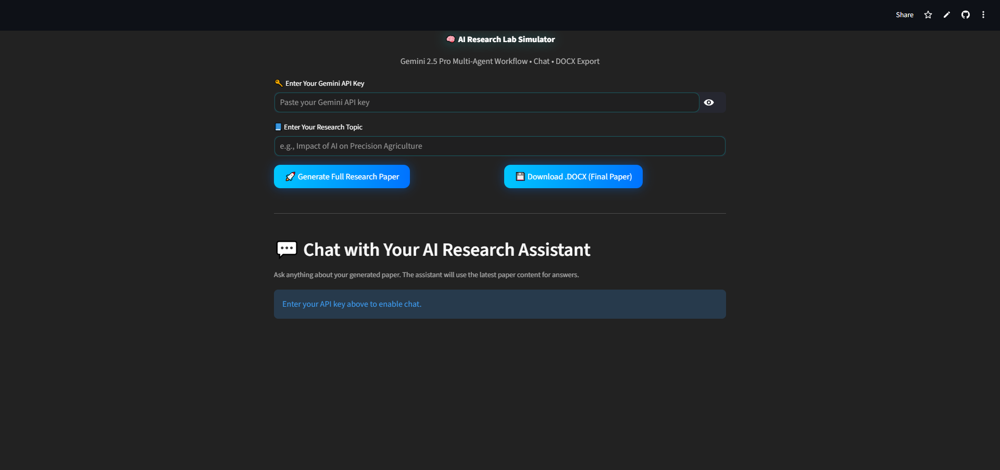

# 🧠 AI Research Lab Simulator

<p align="center">
  
  
  
  
</p>

<p align="center"><b>"Empowering the next generation of researchers — one AI agent at a time."</b></p>

---

## 📘 Table of Contents

1. [Overview](#-overview)
2. [Features](#-features)
3. [Architecture](#-agent-architecture)
4. [Tech Stack](#-tech-stack)
5. [Installation & Setup](#-installation--setup)
6. [Running the Application](#️-running-the-application)
7. [UI Highlights](#️-ui--ux-highlights)
8. [Innovation & Impact](#-innovation--impact)
9. [Evaluation Metrics](#-evaluation-metrics)
10. [Known Issues & Fixes](#️-known-issues--fixes)
11. [Future Scope](#-future-scope)
12. [Team & Credits](#-team--contributions)
13. [License](#-license)

---

## 🚀 Overview

The **AI Research Lab Simulator** is a next-generation **multi-agent Gen AI platform** powered by **Google Gemini 2.5 Pro**, designed to **autonomously generate, review, and finalize research papers**. It replicates the roles of human researchers — from ideation to publication.

---

## 🧩 Features

✅ Multi-Agent Workflow — 7 AI agents simulate the human research process.\
✅ Real-time Streamlit Interface with glassy, futuristic design.\
✅ Interactive AI Chat with persistent context memory.\
✅ One-click `.docx` export for editable research papers.\
✅ Secure API handling with `.env` integration.\
✅ Fully dark, modern UI optimized for laptops and tablets.

---

## 🧠 Agent Architecture

| Agent                | Role                | Description                                    |
| -------------------- | ------------------- | ---------------------------------------------- |
| 🧠 Researcher        | Content Creator     | Generates a detailed draft on the given topic. |
| 🔍 Reviewer          | Logic Analyst       | Refines structure and logical accuracy.        |
| ✍️ Editor            | Language Expert     | Polishes grammar, tone, and readability.       |
| 🧩 Citation Builder  | Reference Curator   | Adds citations and references.                 |
| 🧪 Fact Verifier     | Accuracy Specialist | Ensures factual correctness.                   |
| 🧭 Summarizer        | Synthesizer         | Produces a 200-word executive summary.         |
| 📚 Research Composer | Integrator          | Combines all outputs into one cohesive paper.  |

---

## 🏗️ Tech Stack

* **Language:** Python 3.10+
* **Framework:** Streamlit
* **Model:** Google Gemini 2.5 Pro API
* **Libraries:** `google-generativeai`, `python-docx`, `python-dotenv`, `streamlit`
* **Output Format:** `.docx`

---

## ⚙️ Installation & Setup

```bash
git clone https://github.com/Pranav-Sharma-Official/AI-Research-Lab-Simulator.git
cd AI-Research-Lab-Simulator
pip install -r requirements.txt
```

Create a `.env` file:

```bash
GEMINI_API_KEY=your_gemini_api_key_here
```

---

## ▶️ Running the Application

```bash
streamlit run app.py
```

Steps:

1. Enter your **Gemini API Key** and **Research Topic**.
2. Click **Generate Full Research Paper**.
3. Watch each agent work in real-time.
4. Chat with your AI assistant for clarifications.
5. Export the final `.docx` research paper.

---

## 🖥️ UI & UX Highlights

<p align="center">
  
</p>

* 🖤 Dark glassy UI with glowing cyan elements.
* 📊 Live progress tracking for all 7 agents.
* 💬 Persistent chat assistant using Streamlit’s chat UI.
* 🧾 Real-time result rendering with collapsible outputs.
* 💡 Responsive for both laptops and tablets.

---

## 💡 Innovation & Impact

This project bridges **AI and Academia**, demonstrating how Gen AI can assist in research content generation.
It reduces manual drafting time, enhances accuracy, and supports researchers, students, and educators in academic publishing.

**Applications:**

* Thesis & Dissertation Drafting
* Automated Whitepaper Generation
* Education & Research Training
* Scientific Paper Ideation

---

## 📊 Evaluation Metrics

| Criteria      | Description                                        | Status |
| ------------- | -------------------------------------------------- | ------ |
| Functionality | 7 agents executed sequentially with distinct roles | ✅      |
| Innovation    | Multi-agent AI workflow + real-time chat           | ✅      |
| Design        | Glassmorphic UI with modern visuals                | ✅      |
| Usability     | Editable `.docx` export & persistent chat          | ✅      |
| Scalability   | Modular architecture for domain-specific research  | ✅      |

---

## ⚠️ Known Issues & Fixes

| Issue                | Description                     | Resolution                     |
| -------------------- | ------------------------------- | ------------------------------ |
| PDF Encoding         | FPDF couldn’t handle emojis     | Switched to `.docx` output     |
| Streamlit Chat Reset | Session re-runs lost chat state | Fixed via `st.session_state`   |
| API Latency          | Gemini long response time       | Added spinner + error handling |

---

## 🔮 Future Scope

* 🔗 Multi-user collaborative editing mode.
* 🎙️ Voice assistant for accessibility.
* 📡 Cloud integration (Google Drive / GitHub save).
* 🔍 Built-in plagiarism detection.
* 🧾 Auto reference verification and citation fetching.

---

## 👥 Team & Contributions

| Member            | Role                  | Contributions                                                                              |
| ----------------- | --------------------- | ------------------------------------------------------------------------------------------ |
| **Pranav Sharma** | Team Lead & Developer | Project architecture, backend, prompt engineering, Testing, documentation, and feature QA. |

---

## 🏆 Why This Project Wins

✨ End-to-end AI automation for research generation.
✨ Functional + visually stunning interface.
✨ Real-world applicability with Gemini 2.5 Pro.
✨ Demonstrates deep technical and design skills.
✨ Complete, ready-to-show hackathon-grade product.

---

## 📜 License

This project is released under the [**MIT License**](https://github.com/Pranav-Sharma-Official/AI-Research-Lab-Simulator/blob/main/LICENSE).

---

<p align="center">
  
</p>

<p align="center"><b>Pranav Sharma | AI Research Lab Simulator | 2025</b></p>
